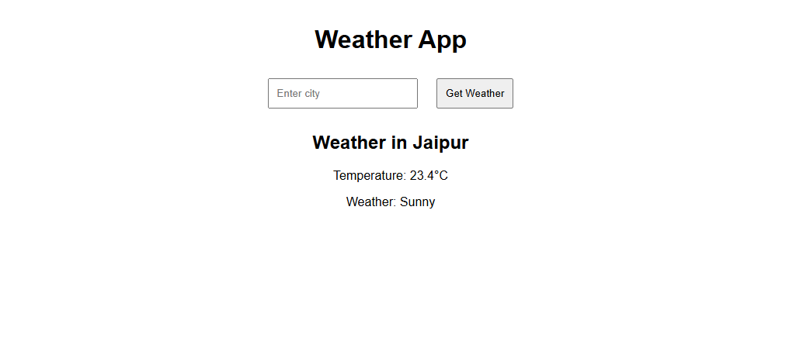

<!-- TOC -->
* [Sky Status](#sky-status)
  * [Project Structure](#project-structure)
  * [Image](#image)
  * [Features](#features)
  * [Requirements](#requirements)
  * [Installation](#installation)
  * [Usage](#usage)
  * [License](#license)
<!-- TOC -->
# Sky Status

A simple weather application that fetches and displays weather data using the WeatherAPI and FastAPI.

## Project Structure

``` plain test
weather_app/
│
├── .gitignore        # Git ignore file
├── config.py         # Configuration file (API key, base URL, etc.)
├── main.py           # Main application script
├── README.md         # Project documentation
├── requirements.txt  # List of dependencies
├── templates/
│   └── index.html    # HTML template for displaying weather data
│
└── static/
    └── style.css     # CSS file for styling the HTML template
```
## Image


## Features

- Fetches real-time weather data for any city.
- Displays temperature, weather condition, and other relevant data.
- Simple and clean user interface.

## Requirements

- Python 3.6+
- FastAPI
- Requests
- Jinja2
- Uvicorn

## Installation

1. **Clone the repository**:

    ```bash
    git clone https://github.com/dyajat/SkyStatus.git
    cd SkyStatus
    ```
2. **Set up a virtual environment**:
    ```bash
    python3 -m venv venv    # For Linux/MaxOS
    source venv/bin/activate   # For Linux/MacOS
    
    python -m venv venv    # For Windows
    venv\Scripts\activate    # For Windows
   
3. **Install dependencies**:

    Make sure you have Python and pip installed. Run the following command in your project directory to install the dependencies:

    ```bash
    pip install -r requirements.txt
   
4. **Create .env files**:
  - Main configuration is located in .env file:
   
 - The .env file is included in .gitignore for security reasons. Please create this files based on the following structure:
    ```bash
    APP_NAME = "SkyStatus"
   APP_VERSION = "1.0.0"
   API_KEY = '*******************'  # Your actual API key
   BASE_URL = 'xxxxxxxxxxxxxxxxxx'


**API Key**:

    Replace `'API_KEY'` in the `.env` file with your actual API key from WeatherAPI.

## Usage

1. **Run the application**:

    Start the FastAPI server by running:

    ```sh
    uvicorn main:app --reload
    ```

2. **Open in browser**:

    Navigate to `http://127.0.0.1:8000/` in your web browser to see your weather app in action.

## License

This project is licensed under the MIT License - see the [LICENSE](LICENSE) file for details.
